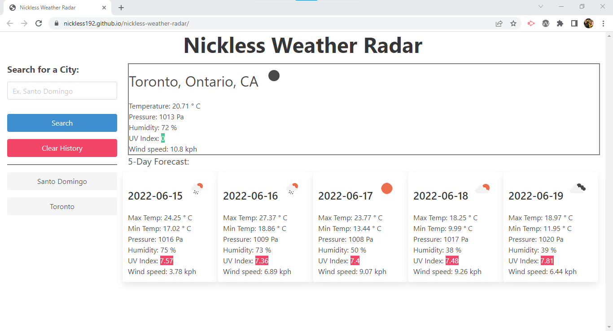

# Nickless Weather Radar

## Description
This site will allow you to search for a city name and it will populate the weather information for this city, along with a 5-day forecast of the next five days.

The site will display the following information for the user:

* Temperature (current temperature and the minimum/maximum for the 5-day forecast)
* Pressure
* Relative humidity
* UV index with color-coding to indicate low (green), medium (yellow), high (orange) and extreme (red)
* Wind speed
* Weather condition

Data will persist if the page is reloaded, with a button added to clear search history both from the page and from local storage. Clicking on a city listed in search history will pull the weather data for that city, without updating the search history.

## User Story

AS A traveler 
I WANT to see the weather outlook for multiple cities 
SO THAT I can plan a trip accordingly 

## Acceptance Criteria

GIVEN a weather dashboard with form inputs 
WHEN I search for a city 
THEN I am presented with current and future conditions for that city and that city is added to the search history 
WHEN I view current weather conditions for that city 
THEN I am presented with the city name, the date, an icon representation of weather conditions, the temperature, the humidity, the wind speed, and the UV index 
WHEN I view the UV index 
THEN I am presented with a color that indicates whether the conditions are favorable, moderate, or severe 
WHEN I view future weather conditions for that city 
THEN I am presented with a 5-day forecast that displays the date, an icon representation of weather conditions, the temperature, the wind speed, and the humidity 
WHEN I click on a city in the search history 
THEN I am again presented with current and future conditions for that city 

## Screenshot of Deployed Site

### Nickless Quizzer Landing Page
 

## Links

GitHub link: https://github.com/nickless192/nickless-weather-radar

Deployed Page: https://nickless192.github.io/nickless-weather-radar/

## Contributors

Made with ❤️ by Nickless192 (Omar Rodriguez)